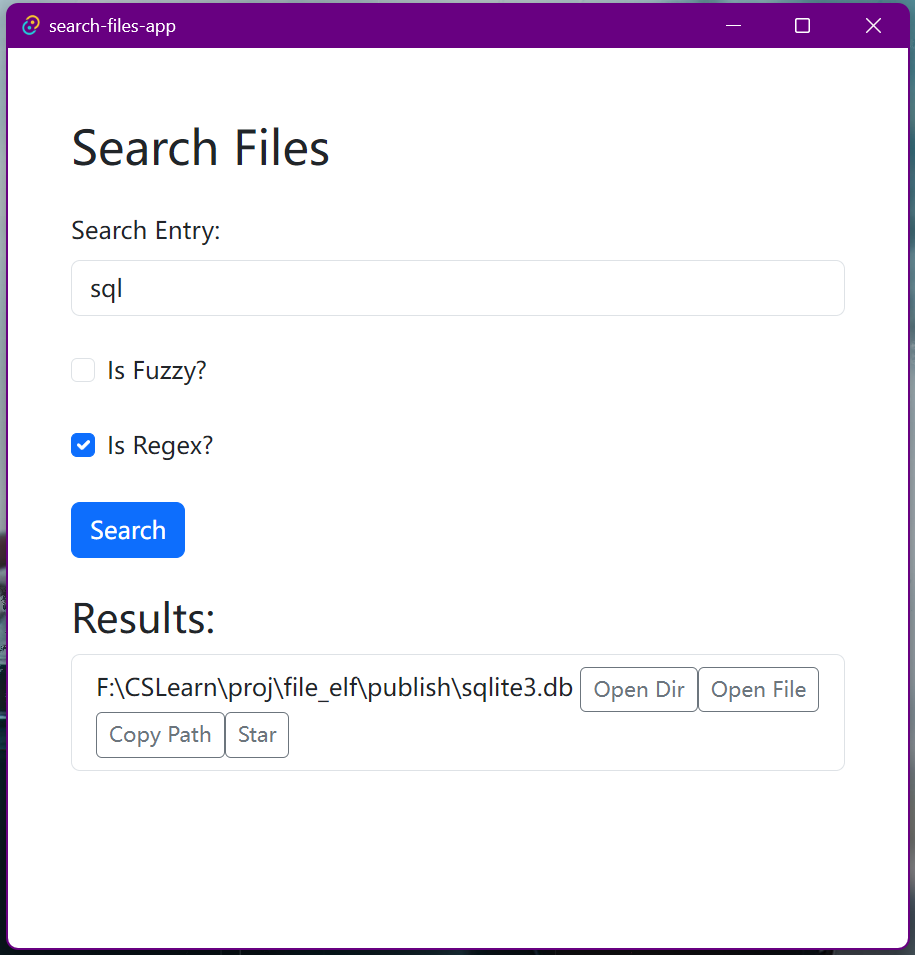

# file_elf 常用文件查询工具

`file_elf` 是一款轻量级的文件查询工具，旨在帮助用户快速查找本地计算机上的文件。它支持精确匹配、模糊匹配、正则查找的搜索方式，并提供了复制路径、打开文件/目录的功能。`file_elf`只会对监控到修改的文件进行索引的建立（这是判断常用文件的依据， 也是设计思路），因此不会进行全盘扫描而占用过多的系统资源。




# 操作说明

- 搜索模式选项说明
  - `Fuzzy`: 是否模糊匹配, 默认不开启
  - `Regex`: 是否正则匹配搜索, 默认开启
    - 为了简化使用, 让不懂正则表达式的朋友们的操作, 默认情况下会在输入的正则表达式前后加入 `.*`
    - 例如输入 `steamapps`搜索等同于输入 `.*steamapps.*`搜索, 可以输入 `steamapps$`显式去除该默认行为
  - `Smart Mode`: 会搜索缓存路径上的热点文件夹
    - 若存在 `/a/b/c`缓存, 则会在热点文件夹 `b`, `a`中搜索目标, 此模式耗时较长
- 搜索结果操作
  - 打开文件或文件夹、`VSCode`打开
  - 通过⭐或☆按钮加入缓存或者从缓存中删除
- 快捷键操作
  - `Ctrl F1`: 隐藏到托盘/唤出 `APP`

# 配置文件

```toml
# ************************************ Windwos ************************************
[database]
dbtype = "sqlite"
path = "sqlite3.db"
targets = [
    "C:\\Users\\toni\\OneDrive",
    "D:\\",
    "E:\\",
    "F:\\",
    "G:\\",
    "H:\\",
] # 指定监听的文件路径前缀, C盘数据读写频繁, 建议不要直接监听C的根目录
blacklist = [
    # ******************* 开发黑名单 ********************
    ".*build.*",
    ".*target.*",
    ".*[Cc]ache.*",         # 缓存文件夹
    ".*\\.git.*",           # git仓库
    ".*\\.vscode.*",        # VSCode项目配置信息
    ".*\\.idea.*",          # jetbrain项目配置信息
    ".*node_modules.*",     # node_modules, node的package, 数量太多
    ".*\\$RECYCLE\\.BIN.*", # 回收站

    # ******************* 微信黑名单 ********************
    ".*WeChat Files\\\\.*\\\\Msg.*",                          # 微信的消息记录
    ".*WeChat Files\\\\.*\\\\config.*",                       # 微信的配置信息
    ".*WeChat Files\\\\.*\\\\FileStorage\\\\MsgAttach.*",     # 微信文件附属消息
    ".*WeChat Files\\\\.*\\\\FileStorage\\\\CustomEmotion.*", # 微信的表情

    # ******************* QQ黑名单 ********************
    ".*QQ files.*\\\\nt_qq.*\\\\nt_db.*",   # QQ本地数据库
    ".*QQ files.*\\\\nt_qq.*\\\\nt_temp.*", # QQ临时数据
    ".*QQ files.*\\\\nt_qq.*\\\\nt_data*",  # QQ数据


    # ******************* 自定义黑名单 ********************
    ".*file_elf.*", # 滤除工具本身

] # 黑名单列表，支持使用正则表达式
hotdirnum = 100
log_level = "trace" # 日志级别
# 注意, windows中使用\\表示分隔符, \需要\\转义, 因此正则表达式中的分隔符为\\\\


# ************************************ Linux or MacOS ************************************
# [database]
# dbtype = "sqlite" # 数据库类型
# path = "/home/toni/proj/file_elf/sqlite3.db" # 数据库文件路径
# targets = ["/home/toni/Course", "/home/toni/proj"] # 监控目录
# blacklist = [".*/build/.*", ".*/target/.*", ".*file_elf.*"] # 黑名单列表，支持使用正则表达式
# hotdirnum = 100
# log_level = "info" # 日志级别
```

# 功能列表

> 最新的功能可能还没有发布到[Release](https://github.com/ToniXWD/file_elf/releases), 需要本地编译

- [X] 快速搜索本地文件, 使用 `Trie`树索引文件
- [X] 支持配置文件添加路径白名单
- [X] 支持配置文件添加路径黑名单(正则表达式)
- [X] 支持模糊搜索和正则匹配
- [X] 支持热点文件夹查询(`Smart Search`)
- [X] 支持搜索结果的动作: 打开文件、打开文件夹、复制路径
- [X] 支持添加(⭐)or删除(☆)搜索到的记录项
- [X] 支持使用 `VSCode`打开搜索结果项
- [X] 配置文件黑名单和过滤规则
- [X] 支持本地日志输出和日志过滤级别
- [X] 重启时检查数据库记录是否有效
- [X] 实现 `app`单例, 避免重复打开
- [X] 前端后端使用更高效的 `IPC`通信, 而不占用本地3000端口(直接使用 `tauri`自带的 `ipc`)
- [X] 支持本地日志输出和轮转
- [ ] 支持配置文件热重载
- [ ] 支持剥离关系型数据库 `sqlite3`存储, 创建自定义的文件格式存储
- [ ] 配置文件支持自定义数据库(目前使用 `sqlite3`)

# 安装和开发

## 1 直接下载编译文件

从[Release](https://github.com/ToniXWD/file_elf/releases)中下载

## 2 本地编译

### 环境依赖

- 后端使用[`Rust`](https://www.rust-lang.org/learn/get-started)开发, 要求版本1.81及以上
- 客户端使用[`tauri 2.0`](https://v2.tauri.app/)和[`react`](https://react.dev/)开发
- 数据库使用 `sqlite3`存储, 如果本地已经安装了 `sqlite3`并添加 `dll`或 `so`到环境变量, 可以在 `tauri.conf.json`的 `resources`中删除动态库的资源依赖

### Windows

```powershell
.\build.ps1 -Build # 编译客户端和服务端
.\build.ps1 -Publish # 打包编译产物和配置文件
```

在 `publish`中可以看到 `search-files-app.exe`文件, 双击运行即可, 同时还会生成 `search-files-app_0.11.0_x64_en-US.msi`和 `search-files-app_0.11.0_x64-setup.exe`安装程序

### Linux or MacOS

> Linux or MacOS 需要更改 `app/search-files-app/src-tauri/tauri.conf.json`中的 `resources`中的 `sqlite3.dll`为 `libsqlite3.so`

```bash
make all # 编译客户端和服务端
make publish # 打包编译产物和配置文件
```

在 `publish`中可以看到 `search-files-app`文件, 双击运行即可

---
